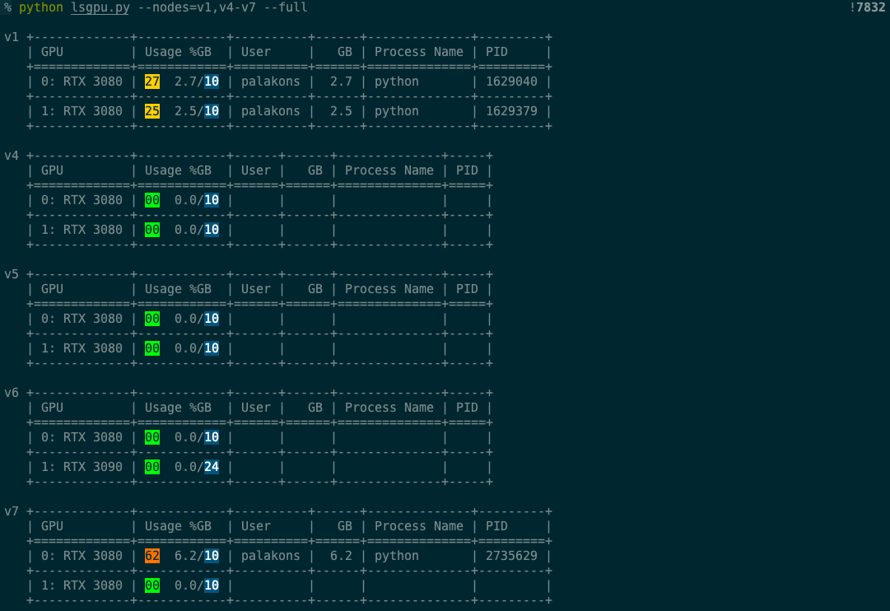

# lsgpu
A utility function to show VLL's GPU information.
Two most useful functions are 
1. `python lsgpu.py` shows GPUs info across all nodes.
2. `python lsgpu.py --local` show GPUs info of the current machine. Like nvidia-smi but also shows the users owning the processes.

These commands can be aliased in `.zshrc` so that you can type `lsgpu` or `ns` (**N**vidia-**S**mi).
```
alias lsgpu='python PATH_TO_FOLDER/lsgpu.py'
alias ns='python PATH_TO_FOLDER/lsgpu.py --local'
```

# Feature showcase:
1. Listing all GPUs across all nodes.
```
python lsgpu.py
```


2. Listing all GPUs across all nodes and showing GPU models and VRAMs.
```
python lsgpu.py --spec
```


3. Like nvidia-smi but also show who are running tasks on the GPUs.
```
python lsgpu.py --local
```


4. Selecting a subset of nodes to print info.
```
python lsgpu.py --nodes=v1,v4-v7
```


5. Selecting a subset of nodes to show full stats.
```
python lsgpu.py --nodes=v1,v4-v7 --full
```

